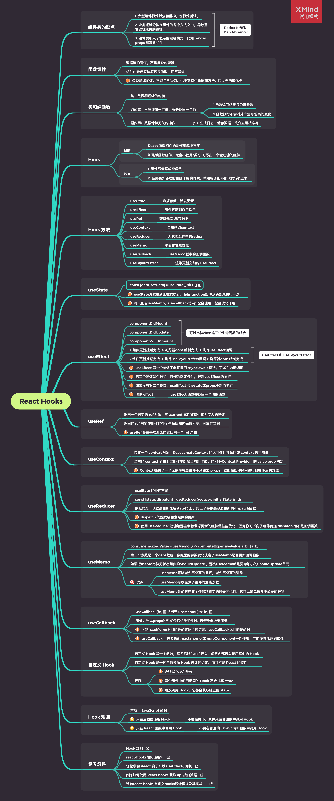

# React Hooks

## 组件类的缺点

1. 大型组件很难拆分和重构，也很难测试。
2. 业务逻辑分散在组件的各个方法之中，导致重复逻辑或关联逻辑。
3. 组件类引入了复杂的编程模式，比如 render props 和高阶组件

## 函数组件

1. 数据流的管道，不是复杂的容器
1. 组件的最佳写法应该是函数，而不是类
1. 必须是纯函数，不能包含状态，也不支持生命周期方法，因此无法取代类

## 类和纯函数

### 类：数据和逻辑的封装

### 纯函数：只应该做一件事，就是返回一个值

- 1.函数返回结果只依赖参数
- 2.函数执行不会对外产生可观察的变化

### 副作用：数据计算无关的操作

- 如：生成日志、储存数据、改变应用状态等

## Hook

### 目的

- React 函数组件的副作用解决方案
- 加强版函数组件，完全不使用"类"，可写出一个全功能的组件

### 含义

- 1. 组件尽量写成纯函数
- 2. 当需要外部功能和副作用的时候，就用钩子把外部代码"钩"进来

## Hook 方法

### useState

- 数据存储，派发更新

### useEffect

- 组件更新副作用钩子

### useRef

- 获取元素 ,缓存数据

### useContext

- 自由获取 context

### useReducer

- 无状态组件中的 redux

### useMemo

- 小而香性能优化

### useCallback

- useMemo 版本的回调函数

### useLayoutEffect

- 渲染更新之前的 useEffect

## useState

`const [data, setData] = useState({ hits: [] })`

useState 派发更新函数的执行，会使 function 组件从头到尾执行一次

可以配合 useMemo，usecallback 等 api 配合使用，起到优化作用

## useEffect

1. componentDidMount
1. componentDidUpdate
1. componentWillUnmount

### 1. 组件更新挂载完成 -> 浏览器 dom 绘制完成 -> 执行 useEffect 回调

### 2.组件更新挂载完成 -> 执行 useLayoutEffect 回调-> 浏览器 dom 绘制完成

### useEffect 第一个参数不能直接用 async await 语法，可以在内部调用

### 第二个参数是个数组，可作为限定条件，限制 useEffect 的执行

### 如果没有第二个参数，useEffect 会受 state 或 props 更新而执行

### 清除 effect，useEffect 函数需返回一个清除函数

## useRef

### 返回一个可变的 ref 对象，其 .current 属性被初始化为传入的参数

### 返回的 ref 对象在组件的整个生命周期内保持不变，可缓存数据

### useRef 会在每次渲染时返回同一个 ref 对象

## useContext

### 接收一个 context 对象（React.createContext 的返回值）并返回该 context 的当前值

### 当前的 context 值由上层组件中距离当前组件最近的 `<MyContext.Provider>` 的 value prop 决定

### Context 提供了一个无需为每层组件手动添加 props，就能在组件树间进行数据传递的方法

## useReducer

### useState 的替代方案

`const [state, dispatch] = useReducer(reducer, initialState, init)`

### 数组的第一项就是更新之后 state 的值 ，第二个参数是派发更新的 dispatch 函数

### dispatch 的触发会触发组件的更新

### 使用 useReducer 还能给那些会触发深更新的组件做性能优化，因为你可以向子组件传递 dispatch 而不是回调函数

## useMemo

`const memoizedValue = useMemo(() => computeExpensiveValue(a, b), [a, b])`

### 第二个参数是一个 deps 数组，数组里的参数变化决定了 useMemo 是否更新回调函数

### 如果把 memo 比做无状态组件的 ShouldUpdate ，那么 useMemo 就是更为细小的 ShouldUpdate 单元

### 优点

- useMemo 可以减少不必要的循环，减少不必要的渲染
- useMemo 可以减少子组件的渲染次数
- useMemo 让函数在某个依赖项改变的时候才运行，这可以避免很多不必要的开销

## useCallback

`useCallback(fn, [])` 相当于 `useMemo(() => fn, [])`

### 用处：当以 props 的形式传递给子组件时, 可避免非必要渲染

### 区别: useMemo 返回的是函数运行的结果，useCallback 返回的是函数

### useCallback ，需要搭配 react.memo 或 pureComponent 一起使用，才能使性能达到最佳

## 自定义 Hook

### 自定义 Hook 是一个函数，其名称以 “use” 开头，函数内部可以调用其他的 Hook

### 自定义 Hook 是一种自然遵循 Hook 设计的约定，而并不是 React 的特性

### 规则

- 必须以 “use” 开头
- 两个组件中使用相同的 Hook 不会共享 state
- 每次调用 Hook，它都会获取独立的 state

## Hook 规则

### 本质： JavaScript 函数

### 只在最顶层使用 Hook

- 不要在循环，条件或嵌套函数中调用 Hook

### 只在 React 函数中调用 Hook

- 不要在普通的 JavaScript 函数中调用 Hook

## 参考资料

- [Hook 规则](https://react.docschina.org/docs/hooks-rules.html)
- [react-hooks 如何使用？](https://juejin.cn/post/6864438643727433741)
- [轻松学会 React 钩子：以 useEffect() 为例](http://www.ruanyifeng.com/blog/2020/09/react-hooks-useeffect-tutorial.html)
- [[译] 如何使用 React hooks 获取 api 接口数据](https://juejin.cn/post/6844903921480105991)
- [玩转 react-hooks,自定义 hooks 设计模式及其实战](https://juejin.cn/post/6890738145671938062)
